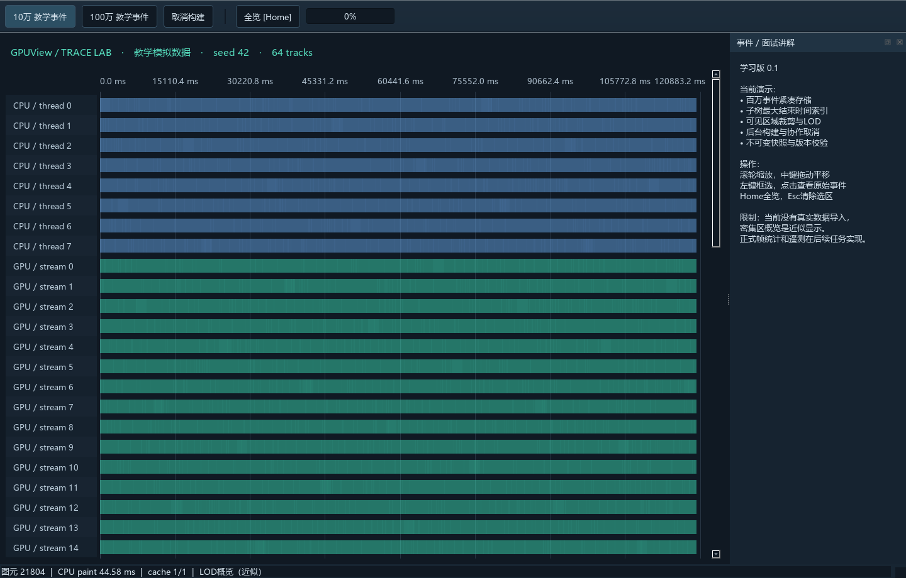
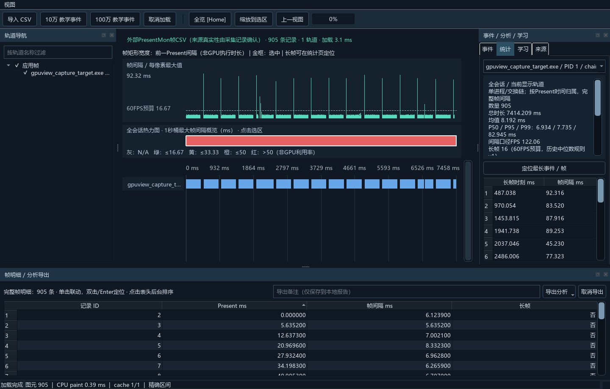

# GPUView

**面向面试讲解和项目式学习的 C++17 / Qt 6 Widgets 性能可视化工具。**

当前是 **v0.3 Widgets 分析演示版**：百万教学事件时间线、精确选区统计，以及真实 PresentMon v1 CSV 的导入、帧间隔曲线和长帧定位已贯通。支持轨道过滤/折叠、事件高亮、视图历史、后台取消与失败保留会话。**仍不是完整 GPU Profiler：没有真实 Kernel、指令或调用栈分析，资源遥测、回放和 Quick 对照尚未实现。**

项目与微软同名 GPUView 工具没有隶属关系。教学模式的 CPU/GPU 轨道全部为模拟数据；另附 [真实帧样本及采集说明](data/samples/PRESENTMON_CAPTURE.md)。





## 为什么做这个项目

围绕十个Qt性能可视化面试问题，把概念落实为可阅读代码、可复现测试和测量。模块解耦，必要位置用中文注释解释线程、生命周期和性能取舍。AI可以参与整个实现过程；学习目标是能够沿代码解释问题、验证方案和修改关键模块。

先读 [十题清单](docs/07-interview/QUESTIONS.md)，再读 [问题解决与代码讲解](docs/07-interview/CASEBOOK.md)。两份文档随功能更新。

## 当前已实现

- 固定seed的10万/100万事件、64轨道、含跨视口长事件。
- 紧凑事件结构与每轨道区间索引，对照朴素扫描验证正确性。
- QWidget/QPainter自绘、轨道裁剪、密集视口概览LOD、精确点击拾取。
- 时间轴滚轮锚点缩放、名称区滚轮上下滚动、中键平移、框选、Home全览、Esc清除。
- 事件/轨道高亮、详情联动、缩放到选区、上一视图、轨道勾选/过滤/分组折叠。
- 后台精确统计：数量、总时长、均值、P50/P95/P99、时长分布、最长项定位。Trace按相交时长裁剪；帧按Present时刻归属。
- PresentMon v1 CSV：引号/BOM/数值校验、无效记录报告、进程/交换链分组；帧间隔曲线、60FPS预算长帧规则、前200条长帧列表（计数不截断）。
- 完整帧明细Model/View、后台排序、稳定ID双向联动；1秒max热力图，点击联动选区。
- CSV统计、Markdown报告及完整帧CSV导出：输入SHA-256、范围/口径/警告/备注；冻结快照、取消和原子保存。
- 事件/统计/学习/来源分栏，加载/取消/失败状态；侧栏关闭后可从“视图”菜单恢复。
- 轨道竖向滚动条位于时间轴右侧、事件侧栏左侧；深色滑槽与浅色加宽滑块区分，悬停/拖动高亮，范围和步长随可见轨道数调整。
- 后台生成/索引，原子进度邮箱、100ms进度轮询、单个待执行请求合并。
- `shared_ptr<const TraceStore>`快照、请求代次检查、协作取消和退出等待。
- 有界单项几何缓存，数据/版本/视口/宽度/轨道变化失效。
- 独立时钟映射算法及测试；尚未接入真实CPU/GPU双源采集。
- Qt Test算法/线程/交互测试，Release查询基准与原始CSV。

## 快速构建（Windows）

### 在IDE里调试

- **VS Code**：打开仓库根目录，按F5选择`GPUView (MSVC Debug)`。预启动任务自动构建Debug并部署Qt DLL；C/C++扩展提供MSVC调试器。
- **Visual Studio 2022**：打开 [GPUView.sln](GPUView.sln)，选择`Debug | x64`，按F5。该工程的源码、包含目录、输出位置均为相对路径或工程宏，构建由CMake完成。
- 可在 [main.cpp](src/app/main.cpp) 或 `SessionController::start` 设置断点。详细步骤及路径边界见 [构建和运行](docs/03-architecture/BUILD.md)。

新增源码只需放入对应模块目录。CMake按目录自动收集；Studio浏览列表由构建脚本自动同步，不必手动把每个文件写进CMakeLists。

已验证 Qt **6.8.3 msvc2022_64**、Visual Studio 2022 C++工具、CMake、C++17。需要匹配的Qt SDK和VS桌面C++组件。

```powershell
./tools/build.ps1 -QtRoot '你的Qt路径/6.8.3/msvc2022_64'
```

脚本自动定位VS自带CMake，配置、编译Release并运行测试。若Qt位于项目内`.tools/Qt/6.8.3/msvc2022_64`，可省略参数；该目录不上传。

一般CMake流程：

```powershell
cmake -S . -B build -G "Visual Studio 17 2022" -A x64 -DCMAKE_PREFIX_PATH="你的Qt SDK路径"
cmake --build build --config Release --parallel
# 手动CMake构建未部署DLL时，运行/测试前把Qt的bin目录加到本次终端PATH
ctest --test-dir build -C Release --output-on-failure
./build/Release/GPUView.exe
```

SDK准备、运行与部署见 [构建和运行](docs/03-architecture/BUILD.md)。

## 运行真实帧演示

点击“导入 CSV”选择 [presentmon-real.csv](data/samples/presentmon-real.csv)，或：

```powershell
./build/Release/GPUView.exe --open data/samples/presentmon-real.csv
```

统计页选择进程/交换链，双击长帧行或点击“定位最长事件 / 帧”；框选重新计算当前显示数据，缩放后可返回上一视图。来源页保留导入警告与输入SHA-256。底部完整明细可点表头排序、单击高亮、双击定位；热力图点击选择1秒，Home回全会话。在明细面板填写备注，通过“导出”选择统计CSV、Markdown或完整帧CSV。导出使用点击时的分析快照。

输入限定为 `Application, ProcessID, SwapChainAddress, TimeInSeconds, MsBetweenPresents` 字段模式（大小写不敏感），额外列允许。QPC、日期时间、其他版本字段拒绝；不把缺失数值补0。支持全部有效Present间隔，尚无Dropped筛选。真实采集可运行 [capture-presentmon.ps1](tools/capture-presentmon.ps1)，需准备固定版本工具并先构建Release。

## 性能证据

运行 `./build/Release/gpuview_benchmark.exe benchmarks/results/repro.csv` 比较同一批100个查询的朴素扫描与索引查询，并检查命中数量一致。

本机首轮Release测量：百万合成事件，100次查询总耗时中位数 **189.406ms → 2.7329ms**；可见16轨道的全览几何为20,336个图元。详情见 [基准报告](benchmarks/reports/BASELINE.md) 和 [原始CSV](benchmarks/results/baseline.csv)。这不是端到端加载、交互P95或屏幕FPS证明。

UI连续交互和缓存开关对照见 [UI_PERFORMANCE](benchmarks/reports/UI_PERFORMANCE.md)，包含10万/100万事件的加载、进程峰值内存及缩放/平移/悬停P50/P95原始数据。测量为离屏同步输入派发到CPU绘制完成，不包含操作系统输入队列、显示合成或屏幕刷新。

## 模块导航

| 目录 | 内容 | 从这里读 |
|---|---|---|
| src/core | 数据、区间索引、几何查询/缓存、时间变换 | [trace_store.h](src/core/trace_store.h) |
| src/adapters | 教学数据生成、PresentMon流式CSV适配器 | [synthetic_source.cpp](src/adapters/synthetic_source.cpp) |
| src/application | 加载/统计任务、快照发布、请求合并、取消 | [session_controller.cpp](src/application/session_controller.cpp) |
| src/ui_widgets | 窗口组装、时间轴绘制和输入 | [timeline_widget.cpp](src/ui_widgets/timeline_widget.cpp) |
| tests | 核心/并发/GUI用例 | [core_tests.cpp](tests/core/core_tests.cpp) |
| tools | 构建、查询/UI基准、D3D11采集目标 | [benchmark_main.cpp](tools/benchmark/main.cpp) |
| docs | 需求、设计、任务、面试讲解 | [当前状态](docs/00-review/STATUS.md) |
| benchmarks | 可公开的原始结果与分析 | [基准报告](benchmarks/reports/BASELINE.md) |

core不依赖Qt；UI不解析文件，不管理worker内部数据。不为每个事件创建QObject或图元对象。

## 后续范围

1. **A后续**：干净环境交付与完整验收；热力图、完整帧明细、CSV/Markdown导出已实现。
2. **B 完整Widgets面试版**：遥测、时间对齐、Trace文件子集、名称聚合、回放、完整性能与发布验证。
3. **C Qt Quick对照学习版**：复用核心数据契约，可由AI辅助；以理解和讲解为目标。

本轮P0/P1改进的逐项证据见 [交付清单](docs/00-review/P0_P1_DELIVERY.md)。这不等于原PRD中A/B全部功能已经验收。按任务包推进，每项功能同步更新README、测试与面试文档。

## 产品与设计文档

[确认记录](docs/00-review/REVIEW.md) · [PRD](docs/02-product/PRD.md) · [UX](docs/02-product/UX.md) · [架构](docs/03-architecture/ARCHITECTURE.md) · [数据规范](docs/04-data/DATA_SPEC.md) · [验收](docs/05-quality/ACCEPTANCE.md) · [路线](docs/06-plan/ROADMAP.md) · [Quick对照](docs/06-plan/QUICK_REBUILD.md) · [面试演示](docs/07-interview/DEMO.md)

个人背景与原始采集仅留本地；公开仓库不含凭据、完整聊天资料及SDK。公开技术文档可独立阅读。

帧明细新增证据：[百万帧测量](benchmarks/reports/FRAME_ANALYSIS.md) · [问题、代码与练习](docs/07-interview/FRAME_ANALYSIS_WALKTHROUGH.md)。Debug/Release均通过52个实际用例（Core 42 + UI 10，不含初始化和清理）。
