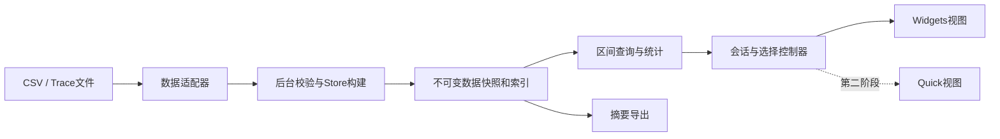

# 技术架构与决策草案

版本：v1.0｜状态：架构方向已确认；本文含目标设计，当前实现差异见下文

## 1. 工具链

### 当前教学内核实现差异

已锁定并验证Qt6.8.3/MSVC2022。core采用纯C++17而非Qt Core，易于独立测试和Quick复用。后台CPU任务使用QThread::create，完成通知为QueuedConnection；原子进度邮箱按100ms轮询。它与后文Worker QObject目标方案具有同样的GUI线程边界，文件导入已通过SessionController接入；另有独立StatisticsController处理范围统计，通用QueryService尚未实现。

当前LOD为每轨4096概览桶和精确查询上限；缓存为一项RenderBatch，未实现通用256MiB LRU。PresentMon适配器位于adapters；精确统计在纯C++ core中实现，由独立控制器调度。MainWindow绑定视图/轨道/选择，TimelineWidget与FrameTimeWidget负责绘制和输入。长帧表使用最多200行的QTableWidget，不给百万记录创建表格项。接口示意不是已发布的API承诺。

建议 C++17、Qt 6 Widgets/Core/Test、CMake、Windows x64。具体 Qt 小版本与 MSVC/MinGW 组合在环境准备任务中依据可获取 SDK 和该版本官方支持矩阵锁定。当前 PATH 命中 Qt 5.9.7/msvc2015，不能混用其库和新编译器；采用独立 Kit 与构建目录，不全局替换旧项目环境。CMake 当前未在 PATH 发现，不等于机器上完全没有安装。

首版自绘图表，不引入额外图表库、数据库和插件动态加载框架。测试统一 Qt Test；开发期按实际编译器能力选择内存检查和 Profiler。SDK 安装、示例编译、打包工具核验均在用户确认后执行。

Qt 的 Model/View 将数据与展示分离，适用于共享数据和自定义表格模型；完整明细表目标使用 QAbstractTableModel + QTableView；当前仅有有界长帧列表，使用QTableWidget。[Qt Model/View](https://doc.qt.io/qt-6/model-view-programming.html)

## 2. 模块关系

| 模块/目录 | 职责 | 不允许依赖 |
|---|---|---|
| src/core | 类型、列式/紧凑存储、索引、统计、时间转换 | QWidget/QML、Windows采集API |
| src/adapters | PresentMon CSV、遥测、Trace 子集解析，能力声明 | 具体UI控件 |
| src/application | SessionController、QueryService、SelectionState、任务生命周期 | 绘制细节 |
| src/ui_widgets | 窗口、时间线、热力图、表格适配、输入映射 | 文件解析与统计算法实现 |
| tools | 独立采集/生成/基准，保存来源元数据 | 自动操作用户游戏 |
| apps/quick | 第二阶段的QML界面、QQuickItem及桥接 | Widgets类 |

core 可以使用 Qt Core 基础类型以控制复杂度；“不依赖 UI”不等于强行做到完全无 Qt。适配器起初静态注册，避免为少量数据源制造插件管理系统。

## 3. 接口契约

- IDataImporter.probe(header)：返回格式、版本候选、必需/可选字段、能力和错误；不能按文件扩展名盲信格式。
- import(source, options, cancelToken, progress)：构建 staging Store，返回 ImportResult；结果包括有效/无效计数、警告、来源元数据。进度限频，不每行发信号。
- QueryService.query(snapshot, range, filter, resolution, requestId)：返回 RenderBatch/StatsResult；结果带 sessionId、snapshotVersion、requestId。
- SessionController：只在成功后交换当前快照；管理会话、视口、选区、过滤和任务；旧结果按版本丢弃。
- ExportService：使用同一快照及明确的分析条件，后台写临时文件后提交目标文件；已有文件通过正常覆盖对话框处理。

范围统一半开区间。渲染查询可请求像素粒度的聚合，统计查询必须访问原始数据或数学上等价的精确索引。返回结果有尺寸限制，不把百万行经 QVariantList 整体交给界面。

## 4. 线程与生命周期

GUI 线程负责 QWidget、已绑定视图的模型通知、输入、快照切换。工作线程负责读文件、校验、索引和统计。QObject 有线程归属，跨线程通知用队列连接；不能从工作线程访问 QWidget。[Qt Threads and QObjects](https://doc.qt.io/qt-6/threads-qobject.html)

首版使用 Worker QObject + QThread 承载导入，有限线程池处理查询。取消标志每批及耗时循环内检查；不用 terminate 强杀。Worker 完成后按归属线程释放对象。关闭顺序：停止新请求 → 发取消 → 等待 worker 完成 → 释放快照/模型 → 销毁窗口。

读取批次建议初值 4096～16384 行，进度最多 10Hz，具体用基准调整。工作线程构建独占 staging Store，完成后通过共享只读快照发布。替换会话时同时持有旧/新数据的峰值要计入预算；若估算超限，提示先关闭旧会话。

查询只保留一个运行任务和最新待执行请求；快速拖拽使旧任务可取消，旧结果即使到达也不应用。渲染快照的队列深度至多2，更新合并，不丢失原始源文件记录。大查询结果析构亦避免造成GUI长停顿。

## 5. 数据结构与渲染

- 百万事件采用数值字段数组/紧凑结构与字符串驻留表；不为每条记录创建 QObject、QStandardItem 或 QVariantMap。
- 每轨道按开始时间排序并建立区间查询结构。点采样用二分；区间事件使用区间树或等价的带最大结束时间索引，避免仅按开始时间二分而漏掉跨越视口的长事件。
- TimelineWidget 自绘网格、可见轨道和候选事件；屏幕外轨道裁剪，短于像素的事件转为密度/占用桶。绘制数量依赖屏幕像素和可见轨道数，而非总事件数。
- 帧曲线使用每像素时间桶 min/max 包络保留尖峰；资源曲线按缺失区间断开。精确悬停在原始数据中二次查询。
- 缓存键包括 session/version、过滤、轨道、时间桶等级、像素宽度、DPR、主题。改变相关因素必须失效；缓存受容量限制，候选上限256 MiB。
- 统计异步计算；快速变更延迟约100ms合并请求，最终结果仍基于用户最后一次输入。
- 时间投影先减视口起点再转浮点，避免大绝对时间戳转double导致像素抖动。

## 6. 回放与内存

B 采用已导入数据的逻辑游标回放，不额外复制全部数据。显示窗口默认最近30秒，可暂停检查；1x/2x按单调时钟推进。UI数据发布最高20Hz，与硬件采样频率无关，鼠标交互绘制按实际事件需要进行。

候选预算：快照+索引+缓存+暂存峰值≤2 GiB；不得因显示30秒就删除原始离线会话。实时扩展若需要环形缓冲和落盘，应另写丢弃/背压策略。

## 7. 决策与替代方案

| ADR | 选择 | 未选方案及原因 |
|---|---|---|
| 001 | 单一桌面进程、分层模块 | 微服务/网络增加部署成本，对岗位证据帮助小 |
| 002 | 自绘时间线 | 每事件一个GraphicsItem容易产生对象开销；后续实测再判断局部使用 |
| 003 | 一次完整发布+可取消后台加载 | 渐进可交互导入增加一致性复杂度，首版不要求 |
| 004 | 核心保留可复用接口 | Widget槽函数直接承载业务会妨碍Quick重做 |
| 005 | 先内存存储，规模预算明确 | SQLite/磁盘索引延后，避免首版先做通用数据平台 |

## 8. 未决技术验证

用户确认后先验证：实际 CSV 字段/时间单位、Qt6 Kit、10万行内存估算、百万区间索引查询、PresentMon与遥测时钟关联方式。验证失败先收缩相应支持声明，不能用猜测填满数据面板。
